# GovConn — Unified Government Services Platform 📱🇱🇰

A mobile app by **Team Vertex** that digitizes and unifies all government services into a single platform. Built with **Flutter** and **Provider**, GovConn eliminates paperwork, reduces queues, and provides a seamless citizen–government interaction experience.

---

## 🌟 Vision
Transform the way citizens interact with government by providing **a single, secure, and intuitive portal** for booking, tracking, and managing all government services digitally.

---

## ✨ Key Features
- 📍 **Unified Portal** – Access healthcare, licensing, taxes, civil registrations, and more in one app  
- 📑 **Digital Workflows** – Step-by-step service guides with required documents  
- 📂 **Document Management** – Upload once, securely reused across services  
- 🏢 **Node-Based Routing** – Automated coordination between government authorities  
- 📅 **Booking System** – Reserve appointments without queues  
- ⏱ **Real-Time Tracking** – Monitor progress and get instant notifications  
- ⭐ **Feedback System** – Rate and review services for accountability  
- 🔐 **Fraud Prevention** – Multi-level identity validation for citizens and authorities  

---

## 📖 Example Use Case
**Applying for a Driving License**
1. Citizen logs in via secure verification  
2. Selects *Driving License Application* workflow  
3. Uploads documents (NIC, birth certificate, etc.)  
4. Books trial and medical appointments  
5. Tracks progress in real time  
6. Receives notifications and final approval  

---

## 🛠️ Tech Stack
- **Framework:** Flutter  
- **State Management:** Provider  
- **Packages Used:**  
  - `google_fonts`  
  - `provider`  
  - `table_calendar`  
  - `http`  
  - `image_picker`  
  - `file_picker`  
  - `path`  
  - `convert`  
  - `flutter_secure_storage`  
  - `flutter_spinkit`  
  - `dropdown_button2`  

---

## 📸 App Screenshots

Here are some key screens of the GovConn mobile app:

<p align="center">
  
  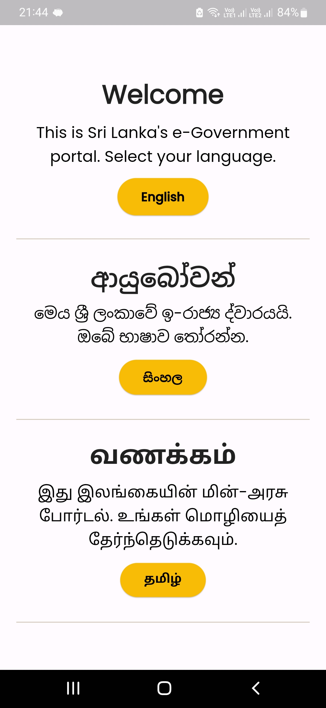
  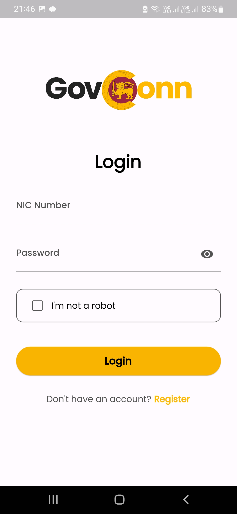
   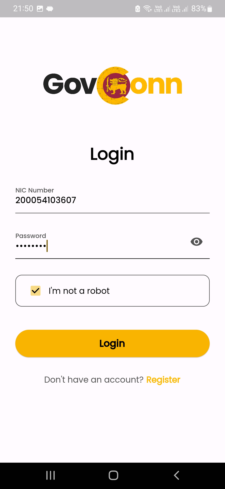
</p>

<p align="center">
 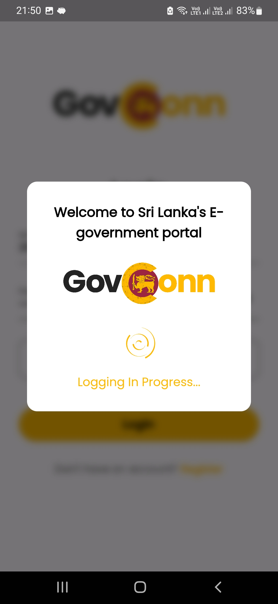
  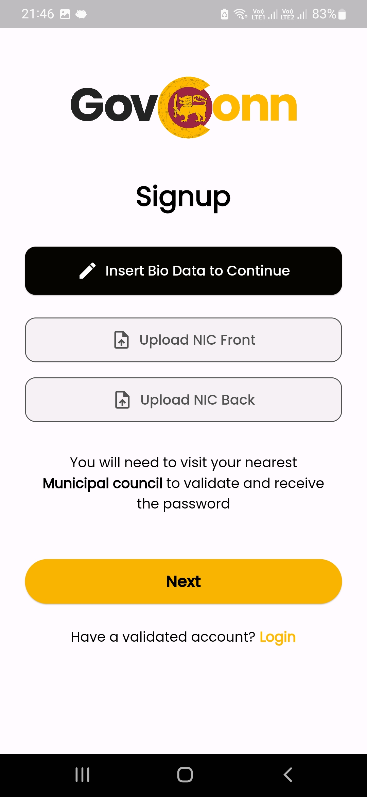
   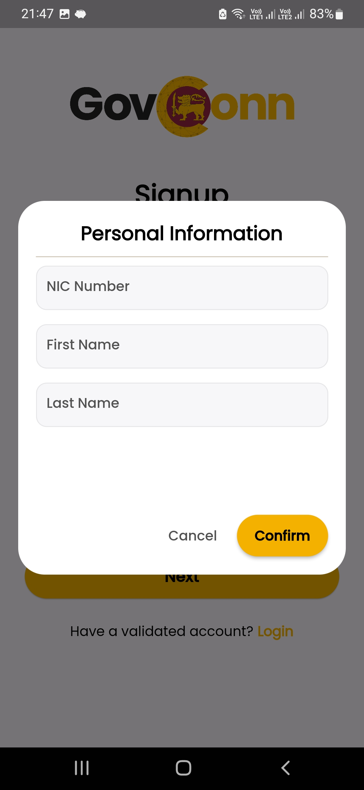
  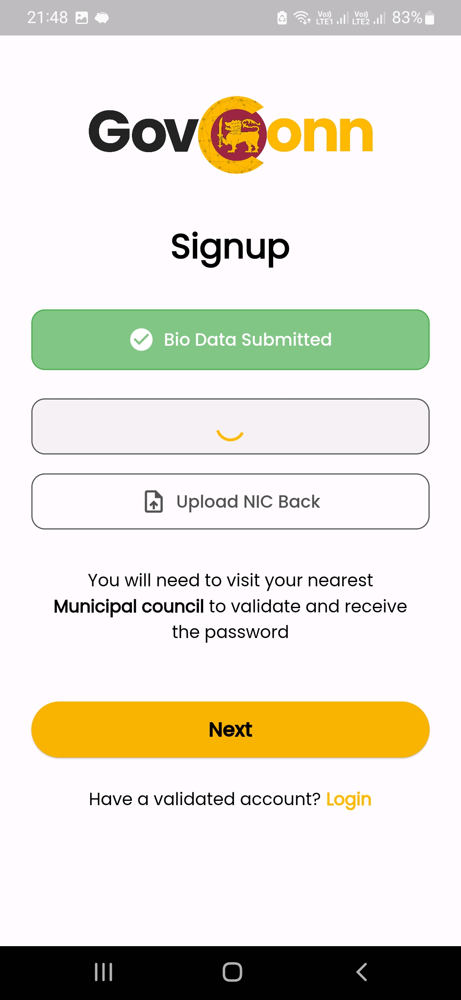
   
</p>

<p align="center">
  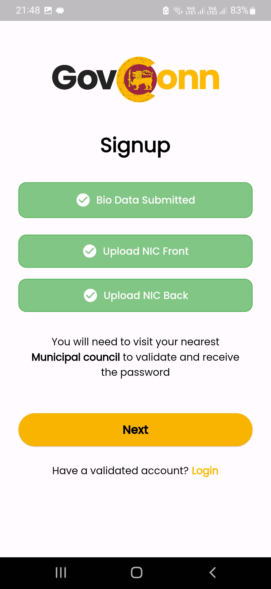
  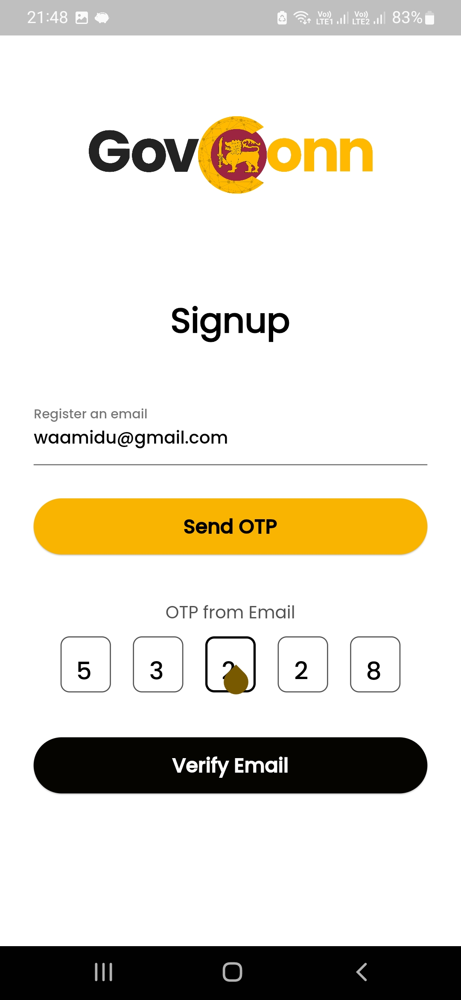
 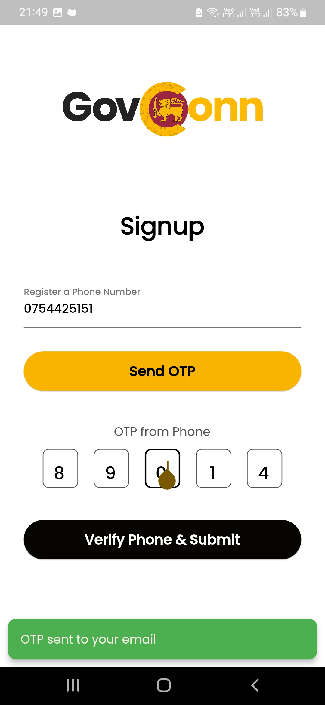
  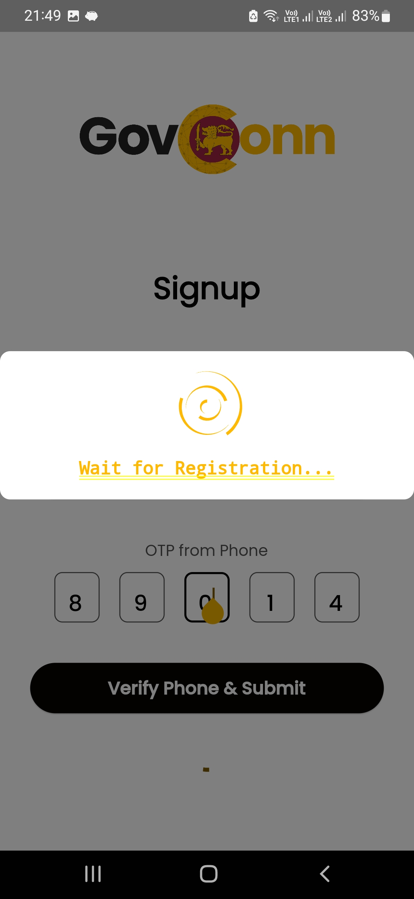
</p>

<p align="center">
  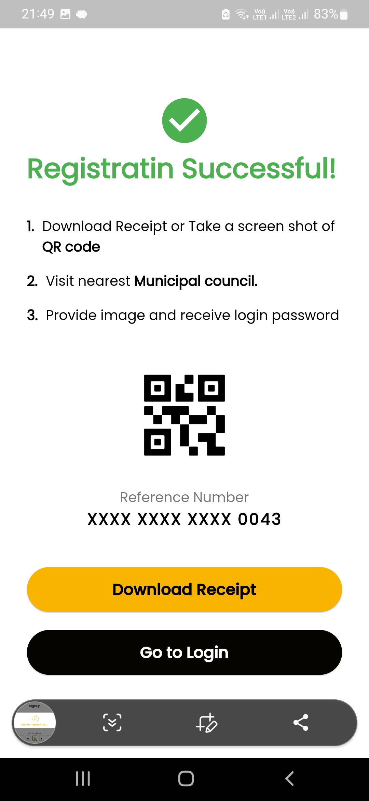 
 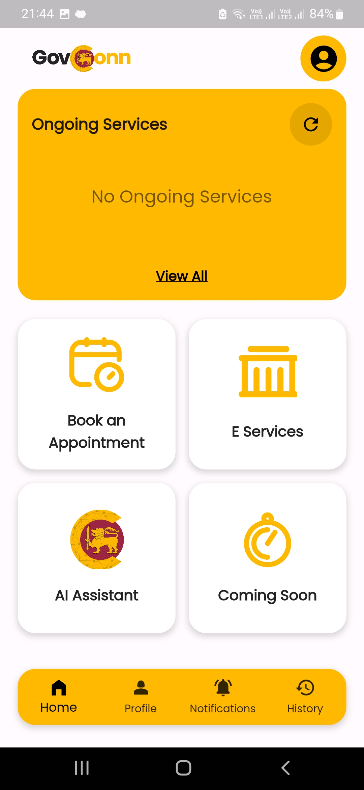
 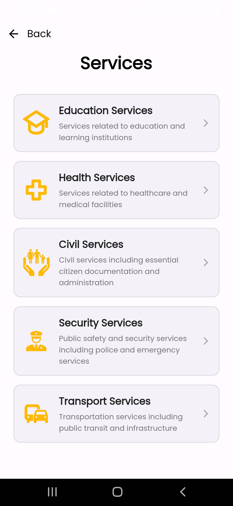
  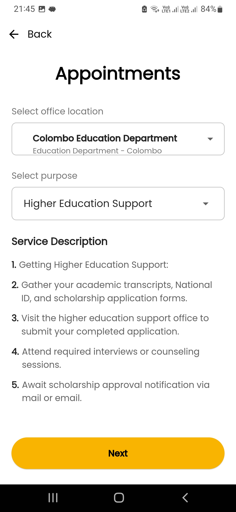
</p>

<p align="center">
  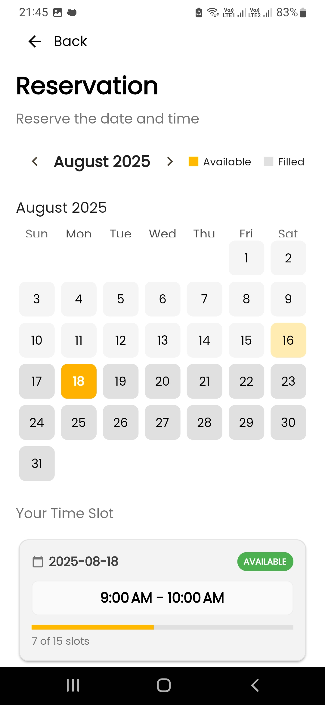
  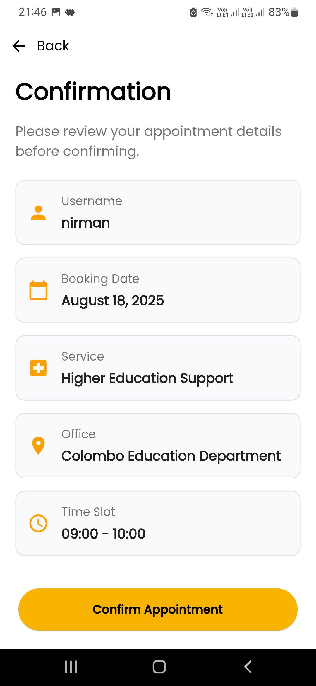
  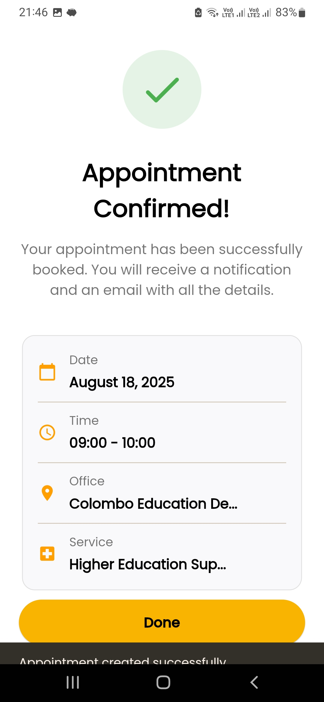
</p>

*(Place your screenshots in a `/screenshots` folder inside the repo.)*

---

## 🚀 Getting Started

### Prerequisites
- Flutter SDK installed  
- Android Studio / VSCode setup  
- Android Emulator / iOS Simulator or physical device  

### Installation
```bash
git clone https://github.com/your-username/govconn.git
cd govconn
flutter pub get
flutter run

